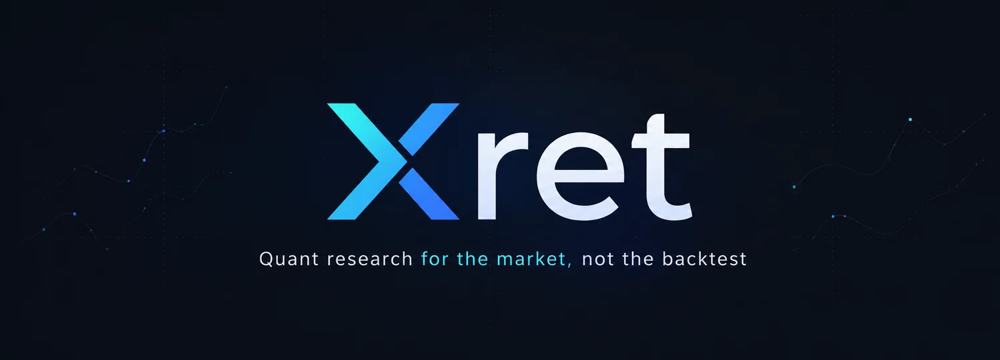

<p align="center">
  
</p>

<p align="center">
  <b>Test ideas. Challenge results. Trade what survives.</b>
</p>

<p align="center">
  <a href="https://github.com/nbsp1221/xret/actions/workflows/ci.yml">
    
  </a>
  <a href="https://pypi.org/project/xret-data/">
    
  </a>
  <a href="https://pypi.org/project/xret-data/">
    
  </a>
  <a href="LICENSE">
    
  </a>
</p>

---

Most backtest results are noise. Parameter sweeps, in-sample fitting, and survivorship bias produce numbers that look like alpha and die on contact with the market.

Xret is a quant research ecosystem for individuals who want to know if their edge is real. One pipeline from market data to live execution, where every experiment is tracked, every backtest must survive out-of-sample scrutiny, and overfitting is structurally harder than honesty.

> [!NOTE]
> **Current status:** Xret is being built in stages. `xret-data` is available today. The end-to-end workflow described here is the direction of the ecosystem; `xret-backtest` and `xret-cli` are planned.

## Ecosystem

Xret is a family of composable Python packages for the quant research lifecycle.

| Package | Purpose | Status |
|---------|---------|--------|
| `xret-data` | Acquire, validate, and store market data | Active |
| `xret-backtest` | Test strategies and challenge results through reproducible experiments | Planned |
| `xret-cli` | Operate and automate the Xret workflow from the command line | Planned |

Each package stands on its own. Together, they form a path from market data to strategies ready for real-world trading.

## Quick start

```bash
uv init market-research && cd market-research
uv add xret-data
```

```python
from xret.data import MarketData

md = MarketData()
bars = md.bars(
    exchange="binance", symbol="BTC/USDT",
    market="perpetual", settle="USDT", timeframe="1h",
)

# Acquire and validate — only missing intervals are fetched
result = bars.sync("2024-01-01", "2024-06-01")
result.require_complete()

# Read — raises CoverageError if any bar is missing
df = bars.scan("2024-01-01", "2024-06-01").collect()
```

`scan` never returns incomplete data. If coverage is missing, it fails loudly instead of silently giving you a wrong answer. This is the Xret contract: **the tool refuses to lie to you.**

## Principles

**Prove it or fail.** Data is validated on ingestion. Backtests require out-of-sample splits. Results that don't survive statistical scrutiny are labeled noise, not alpha.

**One pipeline, no glue.** Xret packages are designed to compose through shared contracts and consistent market identities. Move from data to research to execution without hand-built adapters becoming the workflow. CSV can be an output, but it should never be the integration layer.

**Explicit over implicit.** Every I/O boundary is named (`fetch`, `sync`, `scan`). Every error explains what failed and why. No hidden state, no magic defaults that bite you six months later.

**Built for one person.** No server, no cloud, no team infrastructure. Local Parquet, local SQLite index, one researcher owns the entire pipeline. If an AI agent works alongside you, it follows the same explicit workflow.

## Documentation

- [Getting started](docs/getting-started/index.md)
- [Synchronization guide](docs/guides/synchronization.md)
- [API reference](docs/reference/api.md)
- [Data lifecycle](docs/explanation/data-lifecycle.md)
- [Verified support](docs/quality/verified-support.md)

## Development

```bash
uv sync --locked --all-packages
uv run ruff check .
uv run ruff format --check .
uv run ty check
uv run pytest
uv build --package xret-data
```

## License

MIT
