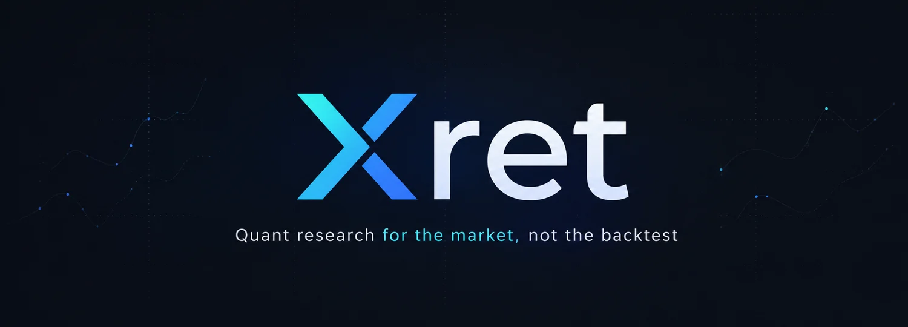

<p align="center">
  
</p>

<p align="center">
  <b>Test ideas. Challenge results. Trade what survives.</b>
</p>

<p align="center">
  <a href="https://github.com/nbsp1221/xret/actions/workflows/ci.yml">
    
  </a>
  <a href="https://pypi.org/project/xret-data/">
    
  </a>
  <a href="https://pypi.org/project/xret-data/">
    
  </a>
  <a href="LICENSE">
    
  </a>
</p>

---

Most backtest results are noise. Parameter sweeps, in-sample fitting, and survivorship bias produce numbers that look like alpha and die on contact with the market.

Xret is a quant research ecosystem for individuals who want to know if their edge is real. One pipeline from market data to live execution, where every experiment is tracked, every backtest must survive out-of-sample scrutiny, and overfitting is structurally harder than honesty.

> [!NOTE]
> **Current status:** Xret is being built in stages. `xret-data` is available today. The end-to-end workflow described here is the direction of the ecosystem; `xret-backtest` and `xret-cli` are planned. See the [roadmap](docs/roadmap.md) for the maintained direction and the boundary between market data, research, and eventual execution.

## Ecosystem

Xret is a family of composable Python packages for the quant research lifecycle.

| Package | Purpose | Status |
|---------|---------|--------|
| `xret-data` | Acquire, validate, and store market data | Active |
| `xret-backtest` | Test strategies and challenge results through reproducible experiments | Planned |
| `xret-cli` | Operate and automate the Xret workflow from the command line | Planned |

Each package stands on its own. Together, they form a path from market data to strategies ready for real-world trading.

## Quick start

```bash
uv init market-research && cd market-research
uv add xret-data
```

```python
from xret.data import MarketData

md = MarketData()
bars = md.bars(
    exchange="binance", symbol="BTC/USDT",
    market="perpetual", settle="USDT", timeframe="1h",
)

# Acquire and validate — only missing intervals are fetched
result = bars.sync("2024-01-01", "2024-06-01")
result.require_complete()
print(result.source if result.source else "local no-op")

# Read — raises CoverageError if any bar is missing
df = bars.scan("2024-01-01", "2024-06-01").collect()
```

`scan` never returns incomplete data. Remote operations are capability-based: Xret attempts provider-advertised CCXT markets and validates every response. Malformed, conflicting, or semantically incompatible data fails before return or storage. This is the Xret contract: **the tool refuses to lie to you.**

## What `xret-data` supports

| Surface | Available today | Important boundary |
|---|---|---|
| Markets | Crypto spot and perpetual | Futures with expiry, options, and non-crypto identities are not part of the current contract. |
| Historical data | Trade bars, settled funding, mark/index/premium-index reference bars, and sampled open interest; incremental sync, canonical Parquet, strict and partial local reads | Complete coverage is reported separately; Xret never fills unexplained gaps or OI retention gaps. |
| Live bars | Provider-advertised time-bar streams | Live observations are transient; applications own historical/live reconciliation, reconnect, and persistence. |
| Providers | Built-in CCXT/CCXT Pro, built-in Binance Data Vision for qualified USDⓈ-M 5-minute historical OI, and an experimental custom-provider API | Provider capability permits an attempt; current responses must still satisfy Xret's contract. |

Xret does not restrict CCXT to a small approved-exchange list. Provider capability and known lossless-compatibility rules determine whether an operation can be attempted; runtime validation and coverage evidence determine whether its result is safe and complete. Select nondefault providers explicitly with `MarketData(provider=...)`: `binance-data-vision` is a separate OI-only provider for the qualified Binance `BTC/USDT` USDⓈ-M `5m` archive scope and never falls back to CCXT or Binance REST. Prior qualification is published separately as useful historical evidence, but it is not execution state and does not create warnings. Read [Provider support and trust](docs/explanation/provider-support.md) for the mental model and [Verified support](docs/quality/verified-support.md) for the tested combinations.

## Principles

**Prove it or fail.** Data is validated on ingestion. Backtests require out-of-sample splits. Results that don't survive statistical scrutiny are labeled noise, not alpha.

**One pipeline, no glue.** Xret packages are designed to compose through shared contracts and consistent market identities. Move from data to research to execution without hand-built adapters becoming the workflow. CSV can be an output, but it should never be the integration layer.

**Explicit over implicit.** Every I/O boundary is named (`fetch`, `sync`, `scan`). Every error explains what failed and why. No hidden state, no magic defaults that bite you six months later.

**Built for one person.** No server, no cloud, no team infrastructure. Local Parquet, local SQLite index, one researcher owns the entire pipeline. If an AI agent works alongside you, it follows the same explicit workflow.

## Documentation

- [Getting started](docs/getting-started/index.md)
- [Roadmap](docs/roadmap.md)
- [Synchronization guide](docs/guides/synchronization.md)
- [API reference](docs/reference/api.md)
- [Data lifecycle](docs/explanation/data-lifecycle.md)
- [Provider support and trust](docs/explanation/provider-support.md)
- [Verified support](docs/quality/verified-support.md)

## Development

```bash
uv sync --locked --all-packages
uv run ruff check .
uv run ruff format --check .
uv run ty check
uv run pytest
uv build --package xret-data
```

## License

MIT
